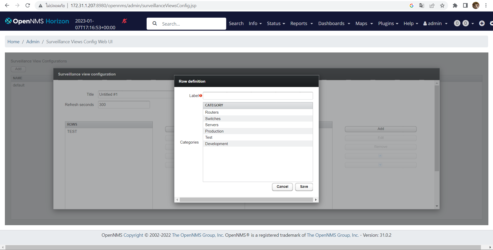

# SPCN-NMS

<p align="center"><a href="https://www.opennms.com/"></p>

    
# <p align="center">การติดตั้ง การใช้งาน และการอ่านผลของเครื่องมือ OpenNMS Horizon</p>
- [ขั้นตอนที่ 1 - ติดตั้ง OpenNMS](#installopennms)
- [ขั้นตอนที่ 2 - ติดตั้ง PostgreSQL](#installpostgres)
- [ขั้นตอนที่ 3 - เริ่มใช้งาน OpenNMS](#startopennms)
- [ขั้นตอนที่ 4 - การเปิด UI ของ OpenNMS ผ่าน Windows OS](#opennmsui)
- [ขั้นตอนที่ 5 - การติดตั้ง Server E-mail ในการส่งการแจ้งเตือน](#serveremail)
    - [การเพิ่ม Node เพื่อใช้ในการ Monitoring](#monitoring)
    - [การเข้าไปดูข้อมูลของ Client](#clientinfo)
    - [การตั้งค่าหมวดหมู่](#setting)
    - [การเพิ่ม Node เข้าสู่ Dashboard](#nodetodash)
    - [การตั้งค่าเสริม](#extension)
    - [ผลที่ได้จากการ monitor](#result)


<a name="installopennms"></a>
## ขั้นตอนที่ 1 - ติดตั้ง OpenNMS

1. ทำการอัพเดท Packages ทั้งหมดก่อนที่จะทำการติดตั้ง OpenNMS โดยใช้คำสั่งดังนี้
```md
apt-get update
```
<p align="center"></p>

2. ทำการติดตั้ง Java Development Kit โดยใช้คำสั่งดังนี้
```md
apt-get install default-jdk gnupg gnupg2 gnupg1 
```
<p align="center"></p>

3. ดาวน์โหลดและสร้างไฟล์สำหรับติดตั้ง OpenNMS โดยใช้คำสั่งดังนี้
```md
[1] wget -O - https://debian.opennms.org/OPENNMS-GPG-KEY | sudo apt-key add -
[2] echo "deb https://debian.opennms.org/ stable main" | sudo tee /etc/apt/sources.list.d/opennms.list 
```
<p align="center"></p>

4. ทำการอัพเดท Packages อีกครั้ง โดยใช้คำสั่งดังนี้
```md
apt update
```
<p align="center"></p>

5. เข้าสู่การติดตั้ง OpenNMS จะใช้คำสั่งดังนี้เพื่อติดตั้ง Package ของ OpenNMS เมื่อติดตั้งสำเร็จแล้ว จะได้ผลลัพธ์ตามรูปภาพด้านล่าง
```md
apt install opennms
```
<p align="center"></p>

<p align="center"></p>

<p align="center"></p>

<p align="center"></p>

<p align="center"></p>

<a name="installpostgres"></a>
## ขั้นตอนที่ 2 - ติดตั้ง PostgreSQL

1. เช็คการติดตั้งภายใน VM/CT ว่ามี Package ของ PostgreSQL อยู่หรือไม่ โดยใช้คำสั่ง
```md
systemctl status postgresql
```
-   โดยถ้าหากไม่มีหรือตรวจสอบแล้วไม่พบเจอ ให้ทำการติดตั้ง Package ดังกล่าวโดยใช้คำสั่งดังนี้
```md
apt install postgresql
```
<p align="center"></p>

2. สร้างฐานข้อมูล โดยใช้คำสั่งตามลำดับดังนี้
```md
[1] su - postgres
[2] createuser -P opennms       //สร้างผู้ใช้ฐานข้อมูล
```
- โดยที่การใส่รหัสนั้น จะสามารถใส่อะไรก็ได้ แต่ต้องกรอกเหมือนกันทั้งคู่
<p align="center"></p>

```md
createdb -O opennms -E UTF-8 -T template0 opennms       //สร้างฐานข้อมูล
```
- อธิบายการทำงานจากคำสั่งย่อดังนี้
    - -O คือ กำหนดชื่อเจ้าของฐานข้อมูล
    - -E คือ การกำหนด encoding
    - -T คือ การกำหนดเทมเพรต

**template0**
เป็นเทมเพลตเปล่าๆที่ไม่มีวัตถุที่ผู้ใช้กำหนดใช้เป็นจุดเริ่มต้นสำหรับการสร้างฐานข้อมูลใหม่ที่ไม่มีวัตถุหรือข้อมูลจากฐานข้อมูลอื่น

**template1**
ในทางกลับกันเป็นเทมเพลตที่มีวัตถุและข้อมูลทั้งหมดจากpostgresฐานข้อมูลเทมเพลตนี้ใช้เป็นจุดเริ่มต้นสำหรับการสร้างฐานข้อมูลใหม่ที่รวมอ็อบเจ็กต์และข้อมูลมาตรฐานทั้งหมดที่มีให้ใน PostgreSQL เช่น pg_catalog

3. ในส่วนนี้ เป็นการเซ็ต Password ของฐานข้อมูลโดย <YOUR-POSTGRES-PASSWORD> คือ Password ที่ต้องการจะตั้ง ดังคำสั่งต่อไปนี้
```md
psql -c "ALTER USER postgres WITH PASSWORD '<YOUR-POSTGRES-PASSWORD>';"
```
<p align="center"></p>

4. หลังจากทำการเซ็ต Password ของฐานข้อมูลเสร็จสิ้น ใช้คำสั่ง exit และ ทำการแก้ไขไฟล์ opennms-datasources.xml โดยใช้ nano ดังคำสั่งดังนี้
```md
nano /usr/share/opennms/etc/opennms-datasources.xml 
```
- โดยจะทำการแก้ไขในส่วนไหนบ้าง?
    - ทำการแก้ไขส่วน user-name ของ opennms
    - ทำการแก้ไขส่วนของ password ให้ตรงกับที่ตั้งรหัสผ่านให้ฐานข้อมูล

<p align="center"></p>

หลังจากทำการแก้ไขเสร็จสิ้น ให้ทำการออกจากไฟล์ด้วยการกด Ctrl+X ต่อไปกด Y และกด Enter เพื่อบันทึกการแก้ไข

<a name="startopennms"></a>
## ขั้นตอนที่ 3 - เริ่มใช้งาน OpenNMS

1. เริ่มต้นด้วยการเปิดระบบ OpenNMS ด้วยคำสั่งดังนี้
```md
/usr/share/opennms/bin/runjava -s
```
<p align="center"></p>

2. ทำการลงไลบรารี่ที่จำเป็น และเชื่อมต่อฐานข้อมูล PostgreSQL โดยใช้คำสั่งดังนี้
```md
/usr/share/opennms/bin/install -dis
```
<p align="center"></p>

3. ทำการเปิดใช้งาน OpenNMS และเช็คการทำงานของ OpenNMS ว่าใช้งานได้ปกติหรือไม่ ตามคำสั่งดังนี้
```md
systemctl start opennms         //เปิดใช้งาน OpenNMS
systemctl status opennms        //เช็คการทำงาน
```
<p align="center"></p>

4. ทำการเชื่อมต่อ OpenNMS เข้าสู่ Port 8980 และ Reload Uncomplicated Firewall (UFW) โดยใช้คำสั่งดังนี้
```md
ufw allow 8980/tcp          //ทำการเชื่อม OpenNMS สู่ Port 8980
ufw reload                  //รีโหลด UFW
```
<p align="center"></p>

<p align="center"></p>


<a name="opennmsui"></a>
## ขั้นตอนที่ 4 - การเปิด UI ของ OpenNMS ผ่าน Windows OS

1. เปิด VPN ที่ทำการเชื่อมต่อกับ Server ของ OpenNMS และเข้าสู่หน้าเว็บไซต์ โดยทำตามขั้นตอนดังนี้
- http://<ip เครื่องที่ลง opennms>:8980/opennms
- ในการเข้าสู่ระบบจะใช้
    - **Username** : admin
    - **Password** : admin

<p align="center"></p>

2. กด Opt-in เพื่อส่งสถิติการใช้ opennms แก่ OpenNMS Statistics เพื่อช่วยเหลือในการปรับปรุงซอฟแวร์

<p align="center"></p>

<a name="serveremail"></a>
## ขั้นตอนที่ 5 - การติดตั้ง Server E-mail ในการส่งการแจ้งเตือน

1. ทำการลง Package เพิ่มเติมในส่วนของ sendmail โดยใช้คำสั่งดังนี้
```md
apt-get install sendmail 
```

2. เช็คสถานะการทำงานของ Package ที่ลงไปก่อนหน้านี้ว่ากำลังทำงานอยู่หรือไม่ โดยใช้คำสั่งดังนี้
```md
systemctl status sendmail 
```
<p align="center"></p>

<a name="monitoring"></a>
### การเพิ่ม Node เพื่อใช้ในการ Monitoring

1. ให้ทำการกดที่เครื่องหมาย + (ตามวงกลมสีแดง)

<p align="center"></p>

2. กรอกข้อมูลตามตัว Client ที่จะต้องการ Monitor

<p align="center"></p>

- **ส่วนที่สำคัญ**
    - **Requisition** สำหรับจัดหมวดหมู่การร้องขอเข้า Monitor ระบบเริ่มต้นจะมีให้เลือกแค่ selfmonitor โดยผู้ใช้สามารถเพิ่มหรือตั้งค่าเองได้
    - **IP Address** คือ IP ของ Client ที่จะทำการ Monitor
    - **Node Label** คือ ชื่อของ node 
    - *ส่วนของ SNMP Parameters (optional)*
        - ให้ตั้งค่า Community String ตามเครื่องที่จะ Monitor โดยค่าเริ่มต้นจะเป็น Public
    - *Surveillance Category Memberships (optional)* คือ การกำหนดหมวดหมู่เพื่อแสดงสู่ Dashboard

<a name="clientinfo"></a>
### การเข้าไปดูข้อมูลของ Client

1. ให้เลือกที่แท็บ Info (วงกลมสีแดง) และเลือก Node (วงกลมสีน้ำเงิน)

<p align="center"></p>

2. เลือก Node ที่ต้องการ

<p align="center"></p>

3. การแสดงข้อมูล Node ในการอ่านผลของข้อมูล หลักๆนั้น จะเป็นการทำงานของ **SNMP** ว่ายังใช้งานอยู่หรือไม่

<p align="center"></p>

<a name="setting"></a>
### การตั้งค่าหมวดหมู่

1. เข้าไปที่การตั้งค่า (วงกลมสีแดง)

<p align="center"></p>

2. เข้าที่เมนู Manage Surveillance Categories

<p align="center"></p>

3. สามารถทำการใส่ชื่อและเพิ่มหมวดหมู่ได้เลย

<p align="center"></p>

<a name="nodetodash"></a>
### การเพิ่ม Node เข้าสู่ Dashboard

1. เข้าที่การตั้งค่าและเลือกเมนู Surveillance Views Configuration (วงกลมสีแดง)

<p align="center"></p>

2. ทำการกด Add หรือ Edit ตัว Surveillance Views ที่มีอยู่แล้ว

<p align="center"></p>

3. กด Add และทำการเพิ่มชื่อ Surveillance Views ที่ Title รวมถึงทำการกำหนดเวลาในการ Refresh

<p align="center"></p>

4. ทำการเพิ่ม Row และ Column ด้วยการกด Add

<p align="center"></p>

5. ตั้งชื่อ Row และ Column และเลือกหมวดหมู่ที่ต้องการแสดง โดยจะต้องเลือก Row และ Column ให้ตรงกับหมวดหมู่ที่เราต้องการแสดงทั้งหมด และกด Save

ข้อมูลจะแสดงสู่ Dashboard สามารถแสดงผลกราฟและแจ้งเตือนต่างๆได้

<p align="center"></p>

<a name="emailnotify"></a>
### การเปิดใช้งานการแจ้งเตือนผ่าน Email

1. เข้าไปที่การตั้งค่าและเลือกเมนู Configure Users, Groups and On-Call Roles (วงกลมสีแดง)

<p align="center"></p>

2. เลือก Configure Users (วงกลมสีแดง)

<p align="center"></p>

3. ในส่วนของตารางช่อง Modify ให้ทำการกดรูปดินสอกระดาษเพื่อแก้ไขในส่วนของข้อมูลการแจ้งเตือน

<p align="center"></p>

4. ในส่วนของ Notification Information นั้นให้พิมพ์ E-mail ลงไปในส่วนของช่อง Email

<p align="center"></p>

5. เลือก Notification Status ให้เป็น On และทำการกดปุ่ม Update

<p align="center"></p>


<a name="extension"></a>
### การตั้งค่าเสริม
- **การตั้งค่า Protocol SNMP และ HTTP**
    - เข้าสู่ตัว VM หรือ CT ที่ต้องการติดตั้ง
    - ติดตั้ง SNMP
    
        ```md
        [1] apt update //อัปเดตแพ็คเกจ 
        [2] apt install snmpd snmp //ลงแพ็คเกจ snmpd และ snmp
        [3] systemctl start snmpd //เปิดการทำงาน snmp
        [4] systemctl status snmpd //เปิดการทำงาน snmp
        ```
    
        - ตั้งค่าระบบ snmp ใน host
    
            ```md
            nano /etc/snmp/snmpd.conf //ทำการเปิดไฟล์ snmpd.conf
            ```
    
            
            - แก้ไข agentaddress เป็น Ip address ของตัว VM หรือ CT
            - เพิ่มข้อความ view systemonly included .1.3 เพื่อให้ protocol snmp เข้าถึงตัวข้อมูลได้มากยิ่งขึ้น
        
            
            - rocommunity <ชื่อ public> default -V systemonly
            - rocommunity6 <ชื่อ public> default -V systemonly
            - เพิ่ม disk เพื่อเข้าถึงการทำงานในไฟล์ เช่น disk / คือเข้าถึงไฟล์ใน root ทั้งหมด
            
            ```md
            systemctl restart snmpd //รีสตาร์ทการทำงาน snmp
            ```
    - ติดตั้ง HTTP
        - เข้าสู่ตัว VM หรือ CT ที่ต้องการติดตั้ง
        - ติดตั้ง HTTP server
    
        ```md
        apt-get install apache2
        ```
        
        - ตั้งค่าระบบ HTTP ใน host
    
            ```md
            nano /etc/apache2/sites-available/000-default.conf //ทำการเปิดไฟล์ 000-default.conf
            ```
    
            แก้ไขโดยการ
                - นำ # ที่แถวของ ServerName ออก
                
                
    
                - แก้ไขชื่อตามที่ต้องการ
                
                
         ```md
         systemctl restart apache2 //รีสตาร์ทการทำงาน HTTP server
         ```
   
- **การติดตั้ง SSH**
    - ในการเปิดการใช้งาน SSH จะใช้คำสั่งดังนี้เพื่อเช็คสถานะของ SSH ก่อนว่าทำงานอยู่หรือไม่
    ```md
    systemctl status ssh
    ```
    <p align="center"></p>

    - หาก SSH ไม่ได้ทำงานอยู่ ให้ทำการเปิดการทำงานโดยใช้คำสั่งดังนี้ และเช็ค Status อีกรอบเพื่อความมั่นใจ
    ```md
    [1] systemctl start ssh             //เปิดการทำงาน SSH
    [2] systemctl status ssh            //เช็คสถานะการทำงานของ SSH
    ```
    <p align="center"></p>

- **การเชื่อม SSH เข้าสู่พอร์ตใน Container**
    - ทำการอนุญาต SSH ให้กับ UFW
    ```md
    ufw allow ssh
    ```
    <p align="center"></p>

    - เปิดใช้งาน UFW และทำการ Reload
    ```md
    [1] ufw enable
    [2] ufw reload
    ```
- การเชื่อมต่อ Container เข้าสู่ระบบ Windows
    - เปิด VPN ของตนที่เชื่อมเข้าสู่ Server ได้
    - เปิด Terminal (cmd) และพิมพ์คำสั่งดังนี้
    ```md
    ssh root@<IP-Address>           //<IP-Address> เป็นหมายเลข IP ของ Container
    ```
    <p align="center"></p>

    - ให้พิมพ์ "yes" เพื่อการเชื่อมต่อที่สมบูรณ์

    <p align="center"></p>
    
<a name="result"></a> 
### ผลที่ได้จากการ monitor
    
    

    - ได้รับข้อมูลตามที่เจ้าของเครื่องได้ทำการตั้งค่าในการส่งข้อมูลผ่าน Protocol SNML โดยจะเป็นข้อมูลเกี่ยวกับการใช้งานต่างๆในระบบ ทั้งสถานะ ที่ดูได้ผ่านกราฟ 
    - การแจ้งเตือนเมื่อมีการทำงานที่ผิดปกติเกิดขึ้นจากตัว Client
